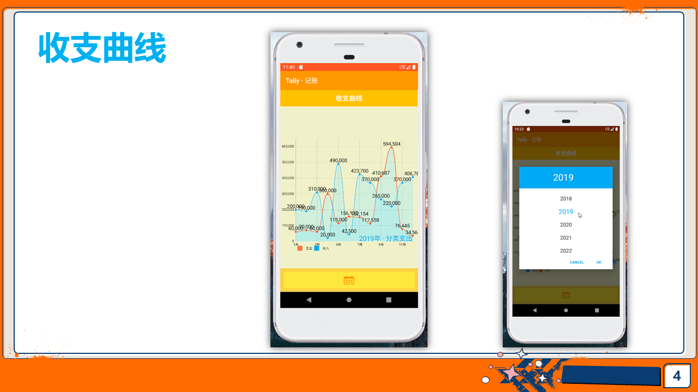
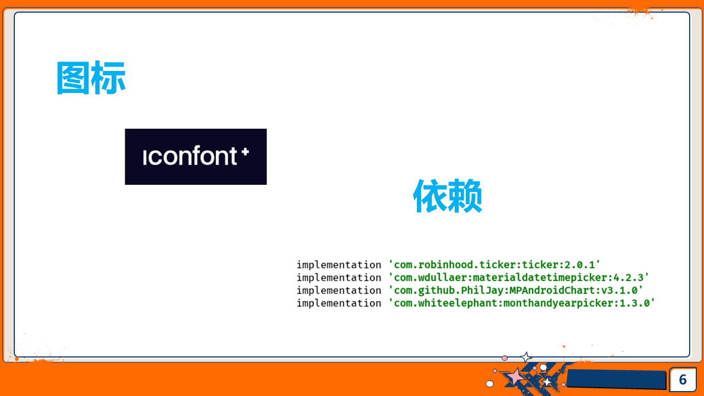
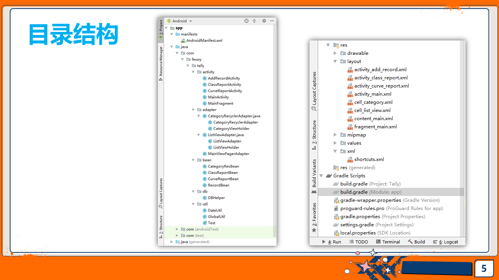

# Tally

- 一个提供记录、查阅、统计功能的轻便简洁记账App
- 使用Java编写，数据库引擎使用SQLite，图表实现采用MPAndroidChart框架
- 插件robinhood:ticker实现数字动效，插件wdullaer:materialdatetimepicker和whiteelephant:monthandyearpicker分别实现对日期、年月的选择

## 界面＆功能

## 依赖＆图标

## 目录结构

## 参考

[https://github.com/terencehyz/AccountingApp](https://github.com/terencehyz/AccountingApp)
